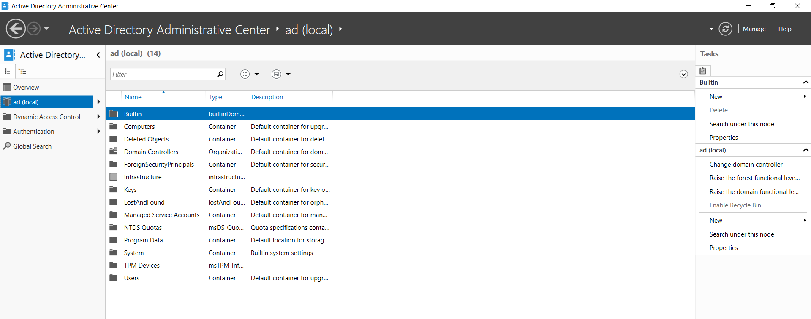
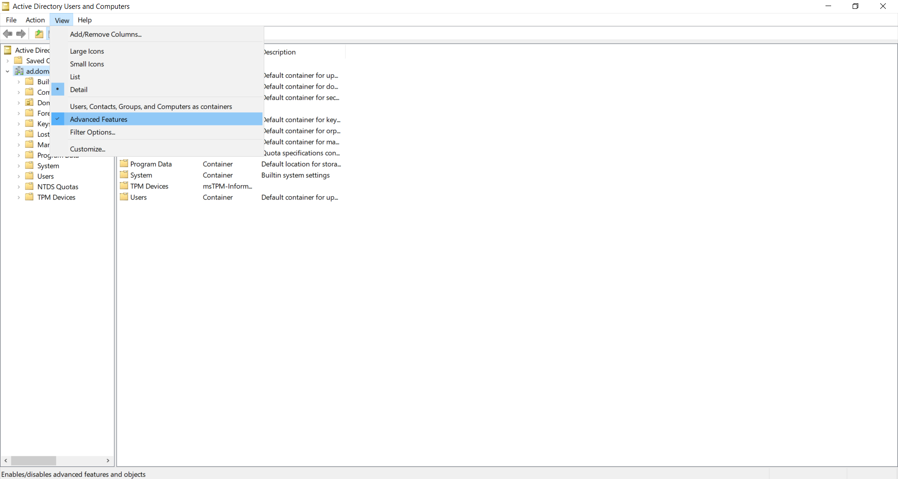

# Active Directory Domain Services Setup

## Prerequisites
- Windows Server 2022 installation completed
- Static IP address configured
- Windows updates installed

## Steps for setting up Domain Controller

1. Install Active Directory Domain Services Role by clicking Manage and choosing "Add Roles and Features".
2. Promote the server to a Domain Controller by creating a new forest. Enter a root domain, e.g., `ad.domain.com`. 
    > I chose to add the ad prefix to the root domain to indicate that it's a local server environment.
3. Verify installation via opening Administrative Tools by confirming the presence of Active Directory Users and Computers.
4. Enable Recycle Bin by entering the Tool menu and visiting Active Directory Administrative Center. In the local server settings, enable the Recycle Bin.
 
5. Enable Advanced Features in the View menu, which allows for viewing and searching for objects throughout the domain.

